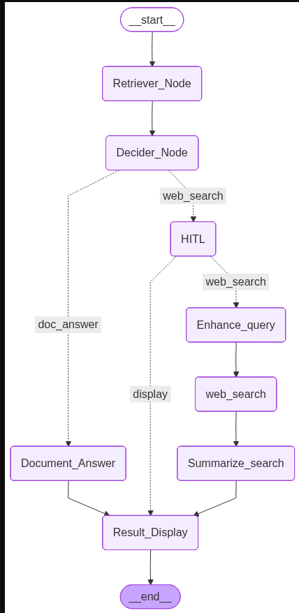

# SmartRAG

An intelligent Retrieval-Augmented Generation (RAG) application built with **LangGraph**, **LangChain**, and **Mistral AI**. It answers questions from your own PDF documents, and only falls back to a web search — with your explicit approval — when the documents don't contain enough information.

## How it works

The pipeline is a LangGraph state machine with a human-in-the-loop checkpoint:

<p align="center">
  
</p>

1. **Retrieve** — your question is embedded and matched against a local Chroma vector store built from your PDFs.
2. **Decide** — an LLM call checks whether the retrieved chunks actually contain the answer.
3. **Answer directly** if the documents are sufficient — no web search, no extra cost, no hallucination risk.
4. **Ask before searching the web** if the documents fall short. Nothing leaves your machine without your "yes."
5. **Enhance, search, summarize** — if you approve, the query is rewritten for better search results, Tavily fetches live results, and each result is summarized into a clean answer.

## Project structure

```
SmartRAG/
├── main.py                  # Entrypoint — load docs, build vectorstore, ask a question
├── notebook.py               # Thin interactive entrypoint for exploring the pipeline cell-by-cell
├── requirements.txt
├── .env                       # API keys (not committed)
│
├── assets/
│   └── graph_diagram.png      # Rendered LangGraph pipeline diagram (used above)
│
├── Schema_Class/
│   └── class_schema.py        # Pydantic models: State, Decision, QueryRewrite, WebSearch
│
├── prompts/
│   ├── decision_prompt.py      # "Is the retrieved context enough to answer?"
│   ├── llm_generate_prompt.py  # Generates the final answer from retrieved documents
│   ├── query_review_prompt.py  # Rewrites the query for better web search results
│   └── answer_prompt.py        # Summarizes a single web search result
│
├── service_llm/
│   └── model.py                # Builds the LLM (Mistral), embeddings model, and Tavily client
│
├── vector_db/
│   └── vector_store.py         # Chroma vectorstore: build, load, and retriever
│
├── ingestion/
│   └── loader.py                # Loads PDFs from the documents/ folder
│
└── graph/
    ├── nodes.py                  # All LangGraph node functions
    └── builder.py                 # Wires nodes into the compiled StateGraph
```

Each folder has a single responsibility, so a change in one area (e.g. swapping the LLM) doesn't require touching the others.

## Setup

**1. Clone and enter the project**
```bash
git clone https://github.com/Darshanshresthaa/SmartRAG.git
cd SmartRAG
```

**2. Create a virtual environment and install dependencies**
```bash
python3 -m venv .venv
source .venv/bin/activate
pip install -r requirements.txt
```

**3. Add your API keys**

Create a `.env` file in the project root:
```env
MISTRAL_API_KEY=your_mistral_api_key
TAVILY_API_KEY=your_tavily_api_key
```

**4. Add your documents**

Create a `documents/` folder in the project root and drop in any PDFs you want to query:
```bash
mkdir documents
cp /path/to/your/files/*.pdf documents/
```

## Usage

**Run from the command line:**
```bash
python main.py
```
This builds the vector store on first run (subsequent runs reuse it), then prompts you for a question.

**Run interactively (notebook-style):**

Open `notebook.py` in VS Code, Jupyter, or any editor that supports `# %%` cell markers, and run cells one at a time to inspect each stage of the pipeline.

**Using the pipeline in your own code:**
```python
from main import ask

answer = ask("What does the document say about transformer architectures?")
print(answer)
```

If the pipeline pauses for web search approval, `ask()` returns the interrupt payload instead of a plain string — check for an `"__interrupt__"` key in the result to detect this case.

## Tech stack

| Component | Tool |
|---|---|
| Orchestration | LangGraph |
| LLM | Mistral (`mistral-small-latest`) via `langchain-mistralai` |
| Embeddings | `sentence-transformers/all-mpnet-base-v2` (Hugging Face) |
| Vector store | Chroma |
| Web search | Tavily |
| PDF loading | PyPDF |
| Schema validation | Pydantic |

## Notes

- The vector store is built once and persisted to `./chroma_db`. Delete this folder if you want to rebuild it from scratch (e.g. after adding new PDFs).
- The human-in-the-loop approval step uses LangGraph's `interrupt()`, backed by an in-memory checkpointer (`MemorySaver`). This means approval state does not persist across process restarts — it's meant for a single interactive session.
- `.env` is gitignored — never commit API keys.
- If you modify the graph structure in `graph/builder.py`, regenerate the diagram with:
  ```python
  from graph.builder import build_graph
  graph = build_graph()
  graph.get_graph().draw_mermaid_png(output_file_path="assets/graph_diagram.png")
  ```
